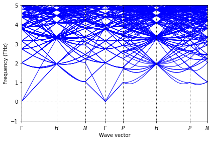

## Phonon calculations

We can use this module to calculate the phonon of any structure given that we have a model that can predict the forces.
This package is a part of my publication:

`"Chen, Chi, Zhi Deng, Richard Tran, Hanmei Tang, Iek-Heng Chu, and Shyue Ping Ong. "Accurate force field for molybdenum by machine learning large materials data." Physical Review Materials 1, no. 4 (2017): 043603."`

Please cite this work if you will use this package elsewhere.
#### Usage

I will use the `Mo SNAP` force field in my paper as an example.
The code was tested on `17 Nov 2016` version of LAMMPS. Make sure that you turn on snap during lammps compilation using `make yes-snap`


##### 1. Set up a model that can predict force

```python
import numpy as np
from io import StringIO
import os
from pymatgen.io.lammps.data import LammpsData
from pymatgen.core import Structure
from monty.tempfile import ScratchDir
import shutil

def read_forces(filename):
    """
    read lammps force dump file
    """
    with open(filename, 'r') as f:
        lines = f.readlines()[9:]
    data = np.loadtxt(StringIO(''.join(lines)))
    return data

def run_file(file):
    """
    Assume lammps is already installed
    """
    os.system('lmp_serial -in ' + file)

def lammps_forces(structures, inputfile):
    forces = []
    with ScratchDir("."):
        shutil.copy(inputfile, 'in.forces')
        for s in structures:
            lmp_data = LammpsData.from_structure(s)
            lmp_data.write_file('data.dump')  # the structure is written to data.dump
            run_file('in.forces')
            forces.append(read_forces('force.data'))
    return forces

class ForceModel(object):
    def __init__(self, filename='../data/in.forces_snap'):
        self.input_file = filename

    def calculate_forces(self, structures):
        """
        calculate forces for structures
        """
        forces = lammps_forces(structures, self.input_file)
        return forces
```

##### 2. Prepare inputs for phonon calculation

```python
s = Structure.from_file('./data/POSCAR')
fm = ForceModel()
model = PhononFromModel(model=fm, structure=s)
```

##### 3. Show phonon dispersion curve
```python
plt = model.get_bs_plot(points_per_line=10)
plt.show()
```


